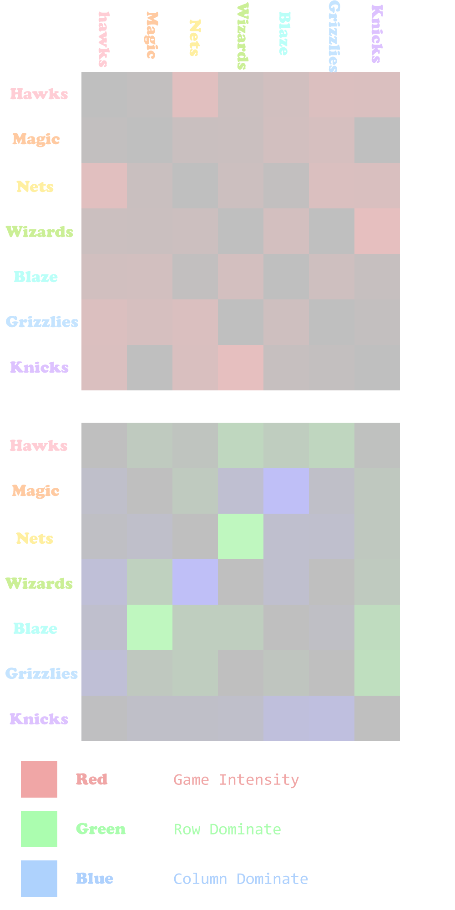
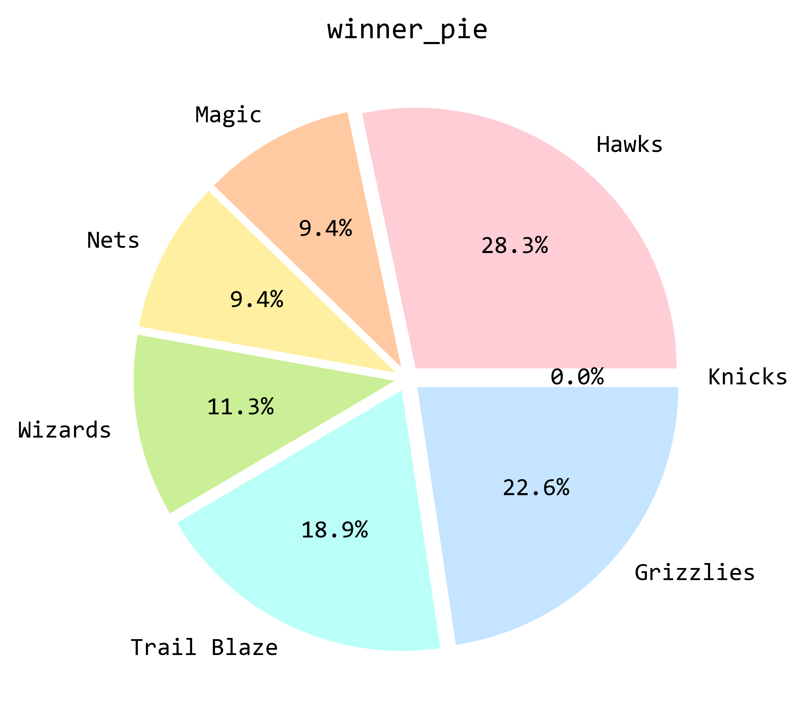
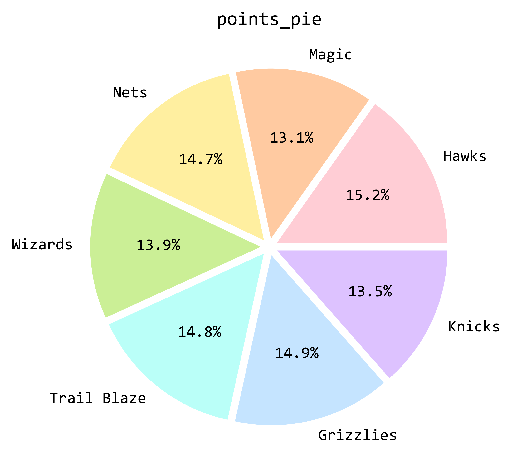
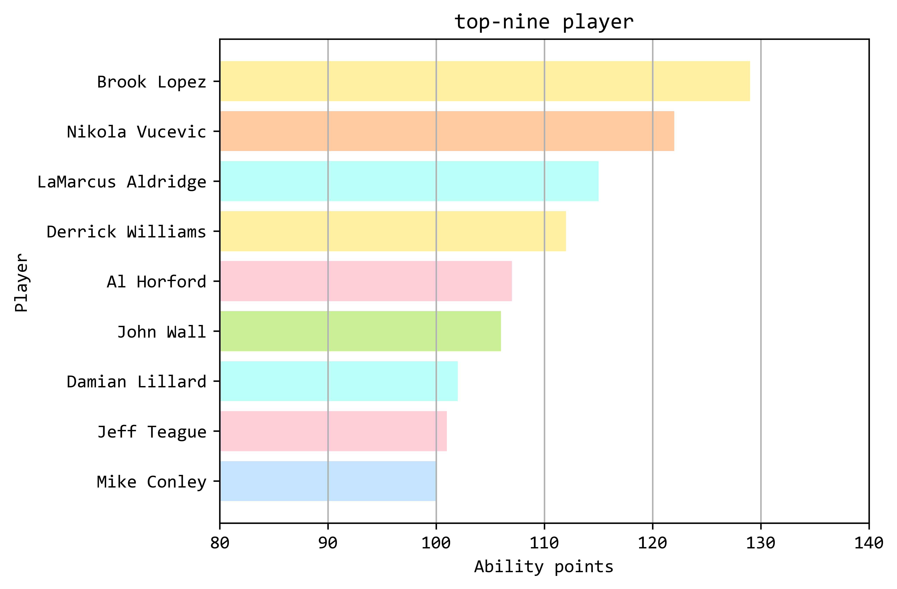
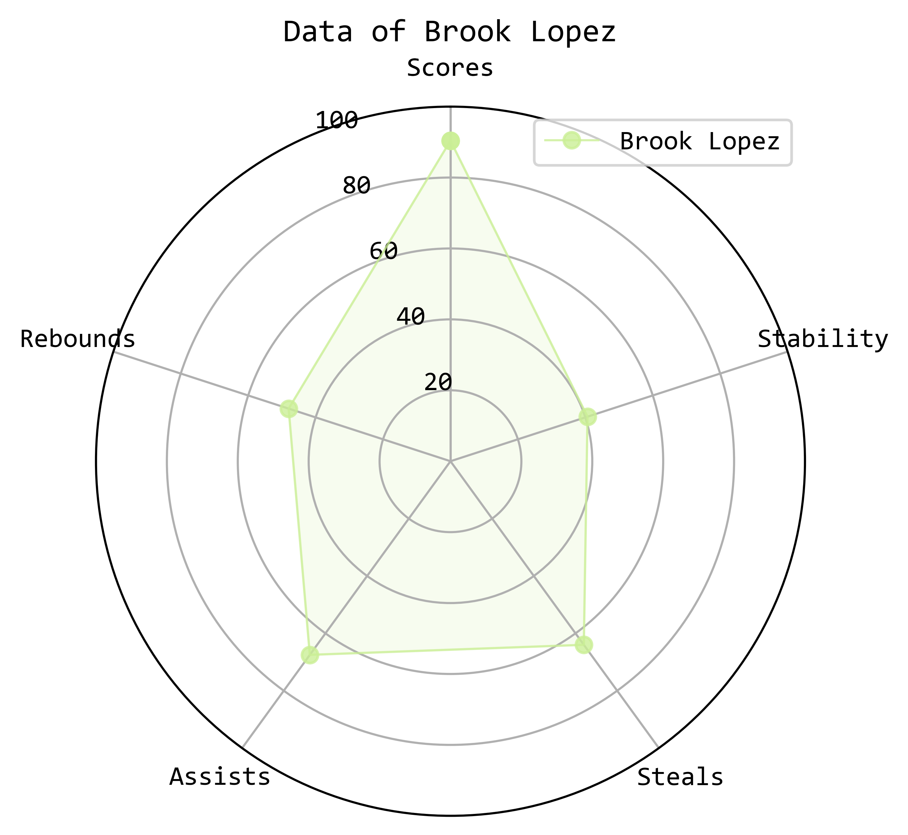
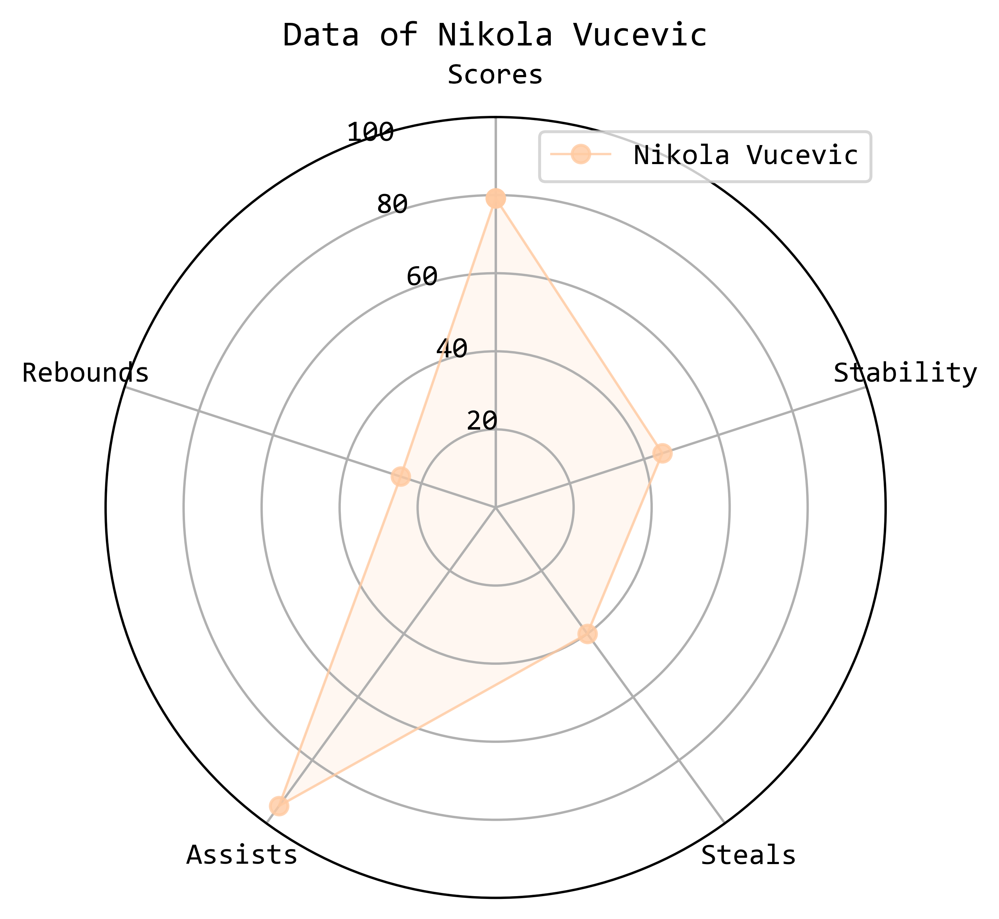
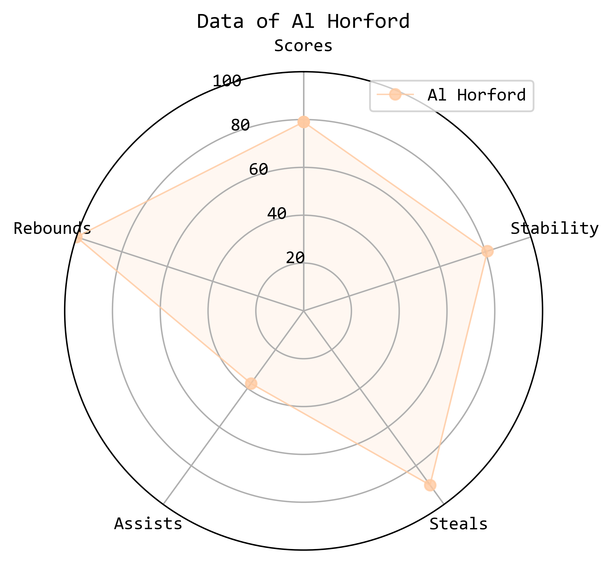

# table分析并可视化的过程(python)

用到的第三方库: 

+ numpy: 数据处理 
+ matplotlib: 图表绘制
+ PIL: 图像处理

可视化成果位于[visualization/picture/python](picture/python/)中

分析与可视化的python代码位于[visualization/src](src/)中

分析资料位于[visualization/src/table](src/table/)中

分析的中期文件和可视化结果位于[visualization/src/output](src/output/)中

### 文本挑选

虽然rotowire.txt中有五百多篇文本, 但要从其中挑选出20篇适合数据分析的文本也并非容易. 文本的挑选首先要解决如下问题: 

1. 队伍数目过多, 倘若各个分析显然不太现实. 而如果要想队伍之间的数据互相比较, 比赛的对手也应当控制, 否则会出现与弱队比赛的队伍成绩相较于与强队比赛的队伍会有优势的情况, 因此此处采用了寻找七个队伍两两之间比赛的文字的方法, 具体筛选程序在text_choose.py中, 因为未能找到七个队伍两两之间都有比赛, 退而求其次挑选了20个文段, 其中缺少了Wizards和Grizzlies之间的比赛. 

2. 文字中的数据参差不齐, 且有相当的缺漏. 因为文段不可能把每个球员的成绩都一一列出, 而给出数据的门类也各有不同, 球员对应的数据也会有所空缺, 因此如何根据这些数据进行分析就成了问题. 因此, 此次分析将主要从球员最常见的四个数据: Scores, Assists, Rebounds, Steals开始着手. 

   

### 分析思路

1. 对七支队伍之间的二十场比赛进行总体分析. 

2. 分析每支队伍占总体的总得分数, 总获胜数, 绘制饼图. 

3. 设计算法对球员综合素质进行排名, 评选出top-9选手, 绘制水平条形图.

4. 对单个选手的各项能力进行分析, 对Scores, Assists, Rebounds, Steals, Stability这五个方面进行打分, 绘制雷达图. 

   

### 提取table

首先将text-to-table这一步中的结果out.data.text进行处理, 将其转换为csv格式, 使其能够被excel打开, 便于直观感受. 处理程序为transform_to_table.py, 结果为out.csv

然后将其人工转化为对python处理更为友好的形式python_read.xlsx, 表格分为Team和Player两个sheet, 接下来就可以调用python的openpyxl库进行处理.

### 前期处理

> table_process.py

在这里, 工作被分为了两个部分: 对球队数据的处理和对球员数据的处理. 在代码中也由team_process和player_process两个函数完成. 

+ team_process: 对七个球队的得分数和获胜数进行了处理, 并存储为teams.csv:

>  Hawks,6,645,
>
> Magic,2,554,
>
> Nets,2,621,
>
> Wizards,2,490,
>
> Trail Blaze,4,625,
>
> Grizzlies,4,526,
>
> Knicks,0,573,

以上每行依次为队伍名, 总获胜数, 总得分数. 

此外, 还需要对每一局比赛的具体状况, 激烈程度, 两队优劣进行呈现, 因此在处理球队数据的同时也绘制了两张图片team_pic1和team_pic2, 经过合并后形成team_pic: 

上面一张图片代表着每一局的激烈程度, 比赛越激烈方格越红, 根据该局双方的总得分数计算, 因此该图像是对称的. 

下面一张图片则是代表着比赛双方哪一方占据优势, 绿色代表横向的一队占据优势, 反之蓝色代表纵向的一队占据优势, 颜色越深也代表着优势越大. 

+ player_process: 该函数将每个球员的scores, assists, rebounds, steals这四个方面的数据进行了汇总, 同时记录了每个球员被记录的次数records (因为文字中并不会包含全部球员的全部数据), 并根据计算公式计算出每个球员的综合能力值: points= (scores * 3 + assists + rebounds + steals)//records + records * 10, 根据该能力值由高到低对球员进行排序并存储为players.csv, 同时挑选出能力值大于100的前九名球员存储为top-nine player.csv

  

### 可视化

> main.py

最后是可视化步骤, 由于先前已经制作出了team_pic.png, 接下来便是分别制作出饼图, 水平条形图, 雷达图. 

+ 饼图: 由team函数汇总teams.csv中各球队数据(注意到这里对少比了一场的Wizards和Grizzlies进行了补正), 并且调用了pie_draw函数分别绘制了各队获胜数和得分数占总体比例的饼图: 

  

+ 水平条形图: 在top_players函数中, 如法炮制汇总前九名球员的数据并根据ability points进行排名调用barh_draw函数绘制水平条形图, 注意到这里各球员的颜色代表着所属的队伍, 与饼图颜色相同, 红色代表Hawks, 橙色Magic, 黄色Nets, 绿色Wizards, 青色Trail Blaze, 蓝色Grizzlies, 紫色Knicks.

  

+ 雷达图: 使用single_player挑选出三名样本较多的球员Brook Lopez, Nikola Vucevic, Al Horford进行单独分析, 同样用到了scores, assists, rebounds, steals这四个数据, 以及根据每次比赛points的数值计算出方差从而得到球员的稳定性, 根据这五项数据调用radar_draw绘制球员的能力雷达图, 由此球员的各项能力以及互相之间的差别比较一目了然. 

  

至此python的可视化部分正式完成! 
